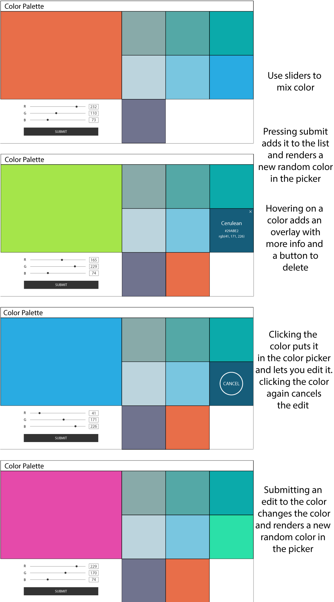

## REQUIRED:
Do your exit tickets please!!

https://goo.gl/forms/DWrZyba2pPwhD1SK2 

# React Color Factory!

For homework you will be making an app for your very own color palette! You will be using [the color API](http://www.thecolorapi.com/docs#colors-color-identification-get) to get more information about your colors and saving them to a database.

## Backend
- create an express API for your colors
- each color should have an id, name, rgb value, and hex value.

|method|route|model method|controller method|
|:----|:---:|:----------:|--------:|
|GET|`/colors`|`color.getAll`|`sendColors`|
|POST|`/colors`|`color.create`|`sendColor`|
|PUT|`/colors/:id`|`color.update`|`sendColor`|
|DELETE|`/colors/:id`|`color.delete`|`sendSuccess`|

## Frontend

For the front end, feel free to be a little bit creative. Think about how you would like to display the information. Heres what it _has_ to do:

- Mix a color
- When the user submits the color, do a call to the color api and get more information on the color then make a call to your api to save the data.
- You can view the information for all of the saved colors
- You can edit a color which will then make another call to the color api to get updated information on the new color and then save the changed data using your api.
- You can delete a color

### Heres a mockup for inspiration:

### [Heres more inspiration](https://jackies-colors.herokuapp.com/)

## BONUS:

- Make your API relational! Have the ability to have multiple palettes that have multiple colors!

## Submission:

Homework is due midnight Saturday night!

